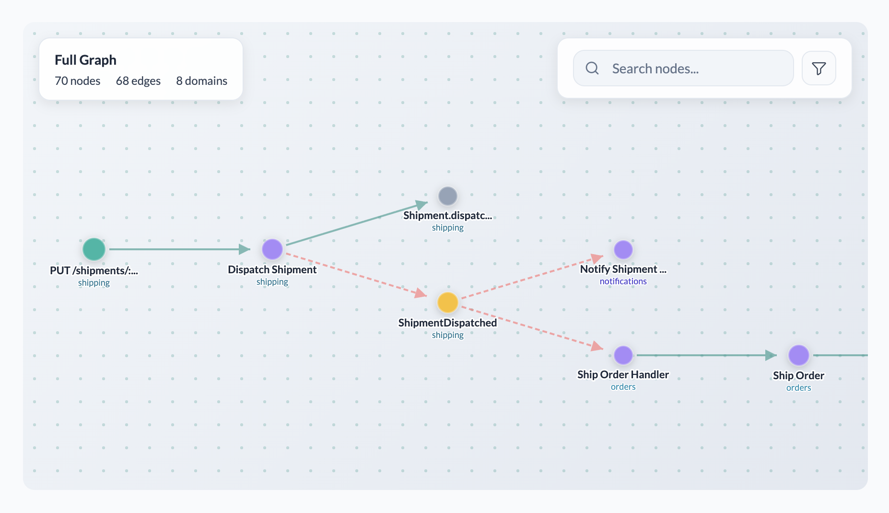

# Living Architecture

**Extract living architecture from code.**

[**View Demo**](https://living-architecture.dev/eclair/?demo=true) · [**Documentation**](https://living-architecture.dev) · [**npm**](https://www.npmjs.com/org/living-architecture)

<p align="center">
  
</p>

See how operations flow through your system — from UI to API to domain logic to events — without manual diagramming. This project provides tools for extracting, modelling, and visualizing a system, using the Rivière graph-based schema.

## How It Works

```text
UI /orders
  → API POST /orders
    → UseCase PlaceOrder
      → DomainOp Order.place()
        → Event order-placed
          → EventHandler NotifyShipping
```

Rivière models operational flow, not technical dependencies. Components have types that reflect their architectural role:

| Type | What It Represents |
|------|-------------------|
| **UI** | User-facing routes and screens |
| **API** | HTTP endpoints (REST, GraphQL) |
| **UseCase** | Application-level orchestration |
| **DomainOp** | Domain logic and entity operations |
| **Event** | Async events published |
| **EventHandler** | Event subscribers |
| **Custom** | Your own types (message queues, external APIs, cron jobs, etc.) |

These are the standard types. Define custom types for anything that doesn't fit — the schema is designed to adapt to your architecture, not the other way around.

The Rivière schema is language-agnostic. Extract architecture from any codebase — TypeScript, Java, Python, Go, or any combination.

## Try It

<table>
<tr>
<td width="50%" valign="top">

### Try the Demo

Open Éclair and explore a sample architecture graph.

**[View Demo →](https://living-architecture.dev/eclair/?demo=true)**

**Sample graph:** [ecommerce-complete.json](https://raw.githubusercontent.com/NTCoding/living-architecture/main/apps/eclair/public/ecommerce-complete.json)

</td>
<td width="50%" valign="top">

### Run Locally

Clone the repo and run Éclair with the demo graph.

```bash
git clone https://github.com/NTCoding/living-architecture.git
cd living-architecture
pnpm install
pnpm nx serve eclair
```

Open [localhost:5173/eclair](http://localhost:5173/eclair/)

</td>
</tr>
</table>

## Extract Your Own Architecture

```bash
npm install -g @living-architecture/riviere-cli
riviere builder init --domain orders --output graph.json
```

See the [extraction guide](https://living-architecture.dev/extract/) for AI-assisted extraction.

## Packages

| Package | Purpose | Install |
|---------|---------|---------|
| `@living-architecture/riviere-schema` | Schema definition and validation | `npm i @living-architecture/riviere-schema` |
| `@living-architecture/riviere-query` | Query graphs. Browser-safe. | `npm i @living-architecture/riviere-query` |
| `@living-architecture/riviere-builder` | Build graphs programmatically | `npm i @living-architecture/riviere-builder` |
| `@living-architecture/riviere-cli` | CLI for extraction workflows | `npm i -g @living-architecture/riviere-cli` |

## Build a Graph

```typescript
import { RiviereBuilder } from '@living-architecture/riviere-builder';

const builder = RiviereBuilder.new({
  sources: [{ repository: 'https://github.com/your-org/your-repo' }],
  domains: {
    orders: { description: 'Order management', systemType: 'domain' }
  }
});

const api = builder.addApi({
  name: 'Create Order',
  domain: 'orders',
  module: 'checkout',
  apiType: 'REST',
  httpMethod: 'POST',
  path: '/orders',
  sourceLocation: { repository: 'repo', filePath: 'src/api/orders.ts' }
});

const useCase = builder.addUseCase({
  name: 'PlaceOrder',
  domain: 'orders',
  module: 'checkout',
  sourceLocation: { repository: 'repo', filePath: 'src/usecases/place-order.ts' }
});

builder.link({ from: api.id, to: useCase.id, type: 'sync' });

const graph = builder.build();
```

## Query a Graph

```typescript
import { RiviereQuery } from '@living-architecture/riviere-query';

const query = RiviereQuery.fromJSON(graphData);

// Find all entry points
const entryPoints = query.entryPoints();

// Trace a flow from a component
const flow = query.traceFlow('orders:checkout:api:create-order');

// Find cross-domain connections
const crossDomain = query.crossDomainLinks('orders');

// Get components by type
const events = query.componentsByType('Event');
```

## The Rivière Schema

Rivière graphs are JSON documents conforming to the [Rivière schema](./packages/riviere-schema/riviere.schema.json).

```json
{
  "metadata": {
    "domains": {
      "orders": { "description": "Order management", "systemType": "domain" }
    }
  },
  "components": [...],
  "links": [...]
}
```

See [examples](./packages/riviere-schema/examples/) for complete multi-domain graphs.

## Visualize with Éclair

Open your graph in [Éclair](./apps/eclair/), the interactive visualizer:

- Trace flows end-to-end
- Filter by domain
- Search components
- Click through to source code

## Documentation

See [apps/docs](./apps/docs/) for full documentation.

## Links

- **Website & Docs**: [living-architecture.dev](https://living-architecture.dev)
- **Éclair Visualizer**: [living-architecture.dev/eclair](https://living-architecture.dev/eclair)
- **npm**: [@living-architecture](https://www.npmjs.com/org/living-architecture)

## Author

Created by [Nick Tune](https://nick-tune.me) ([Bluesky](https://bsky.app/profile/nick-tune.me), [LinkedIn](https://linkedin.com/in/nick-tune), [GitHub](https://github.com/ntcoding)).

## Contributing

See [CONTRIBUTING.md](./CONTRIBUTING.md).

## License

Apache-2.0
